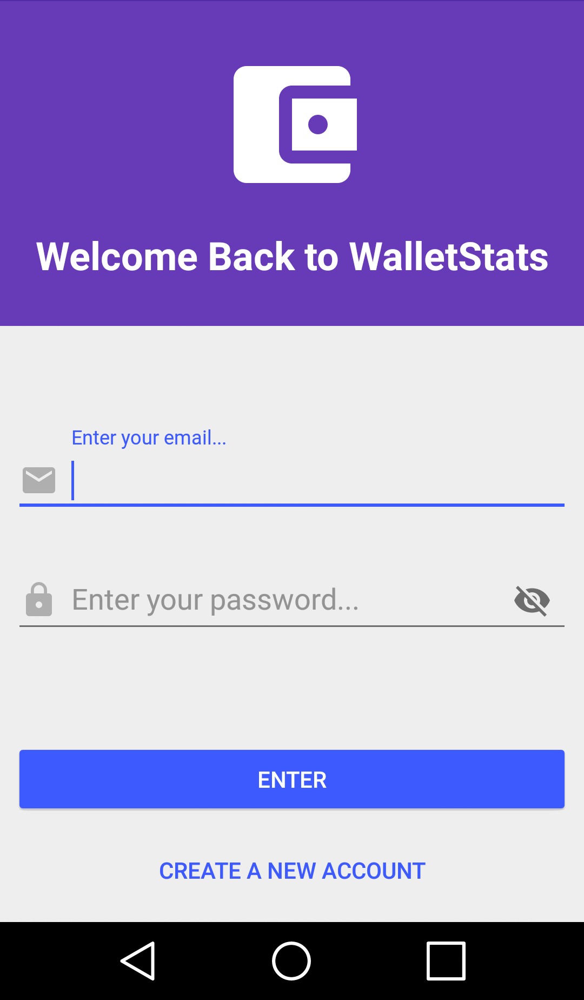
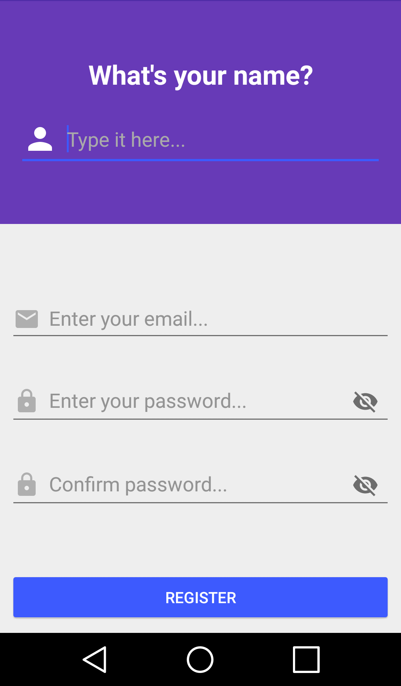
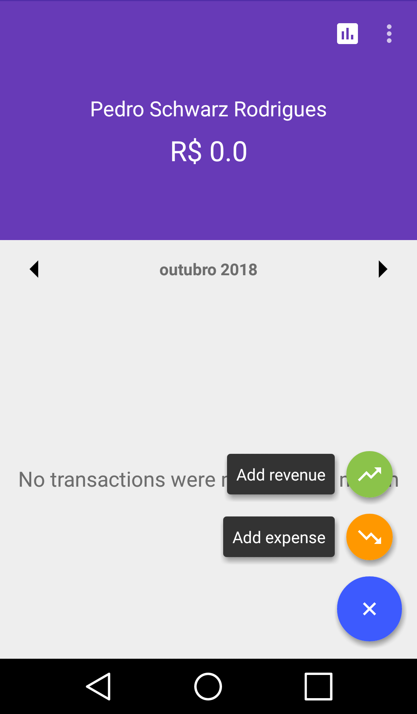
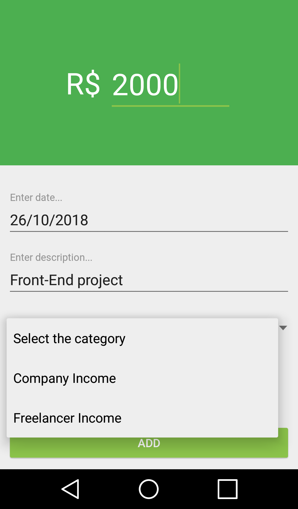
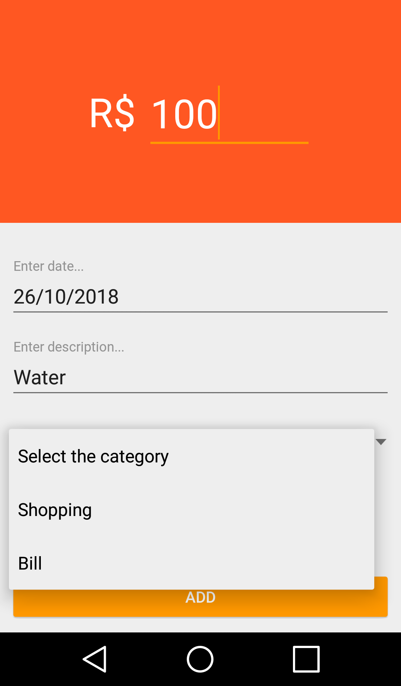
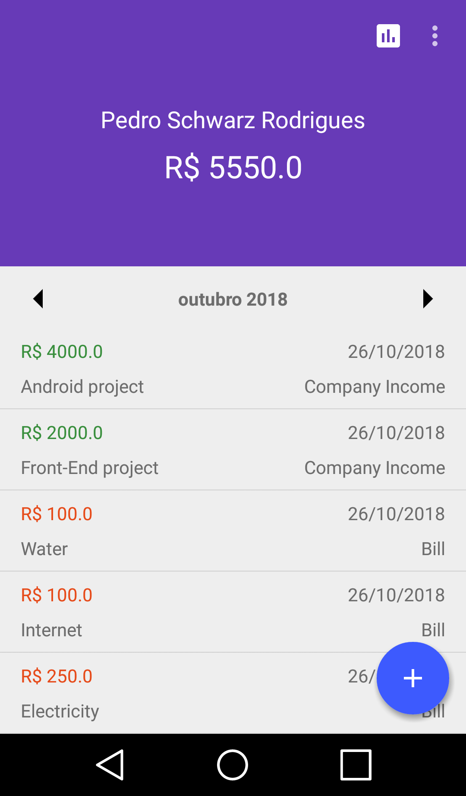
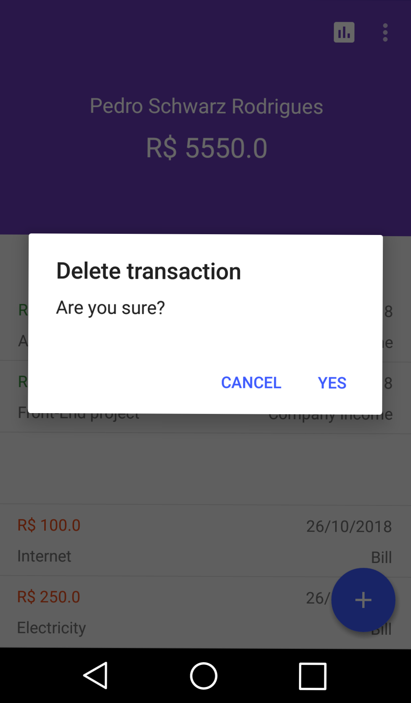
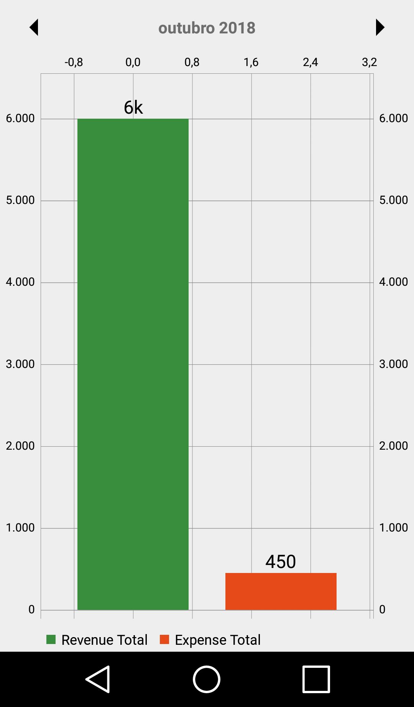

# WalletStats
App for controlling and managing personal money. Written in Java for Android.  
Inspired by the financial app Organizze. The app can be found at https://play.google.com/store/apps/details?id=com.organizze.android.   or at https://www.organizze.com.br.

<h2>DEPENDENCIES</h2>

Floating Action Menu - https://github.com/Clans/FloatingActionButton

Material Calendar View - https://github.com/prolificinteractive/material-calendarview

MPAndroidChart - https://github.com/PhilJay/MPAndroidChart

Firebase Firestore & auth - https://firebase.google.com/docs/android/setup

<h2>SCREENS</h2> 

<h4>Login Screen</h4>

  Here the user can access it's account or go to the registration screen to create a new one.

  <strong>*Uses</strong> Firebase Authentication  

<h4>Register Screen</h4>

  Here the user can create a new account.

  <strong>*Uses</strong> Firebase Authentication & Firebase Firestore

<h4>Main Screen</h4>

  The main screen is where the user's transactions and account balance are displayed.  
  The list is filtered by the month and year. the user can switch the date by swiping the calendar in the middle of the screen  
  or by clicking the arrows on the edges.  
  By clicking in the fab menu the user has the option to add a new expense or revenue to his account.

  <strong>*Uses</strong> Firebase Firestore, Floating Action Menu & Material Calendar View 

<h4>Add Revenue Screen</h4>

  Here the user can add a new revenue to his account in the specified date.  
  By default the date input is set to the current date, but can be easily changed.

  <strong>*Uses</strong> Firebase Firestore

<h4>Add Expense Screen</h4>

  Here the user can add a new expense to his account in the specified date.  
  By default the date input is set to the current date, but can be easily changed.

  <strong>*Uses</strong> Firebase Firestore

<h4>Populated Main Screen</h4>

  After populating the account with some transactions, they are listed in the the main screen.  
  The list is ordered by the type of transaction where the revenues are listed first followed by the expenses.  
  Below the username is located the account balance, summing all the revenues registered and subtracting the sum of all the expenses    registered as well.

  <strong>*Uses</strong> Firebase Firestore & Material Calendar View

<h4>Deleting Transactions</h4>

  In case the user has to delete a transaction, it can be easily done be simple swiping one of the items in the list.  
  After swiping, a alert dialog will be displayed with two options, one to proceed with the action and another one to canceling it.

  <strong>*Uses</strong> Firebase Firestore & Material Calendar View

<h4>Graph Screen</h4>

  The graph screen can be shown by clicking the "graph" icon in the action bar on the main screen.  
  There is displayed the sum of the revenues in a given month as well as the sum of the expenses.  
  In case the user wants a visual representation of its wallet stats.

  <strong>*Uses</strong> Firebase Firestore, Material Calendar View & MPAndroidChart

